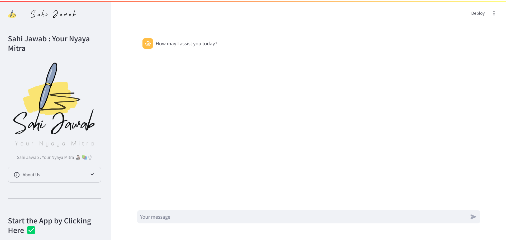
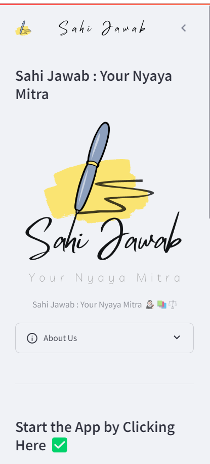
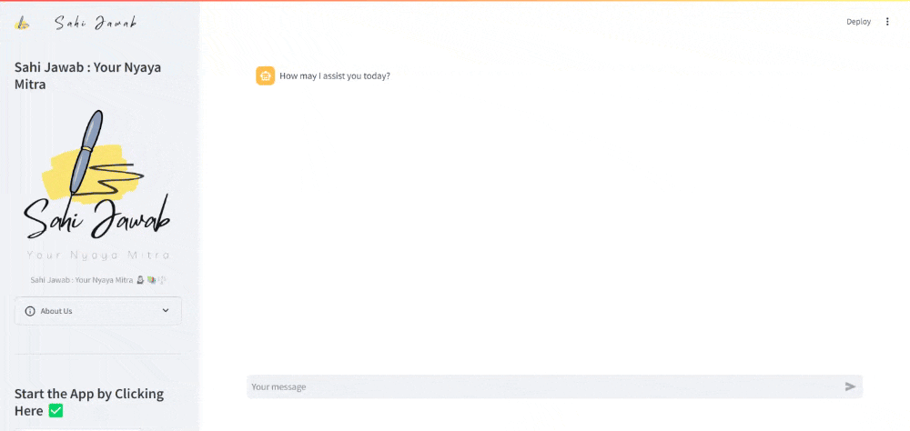
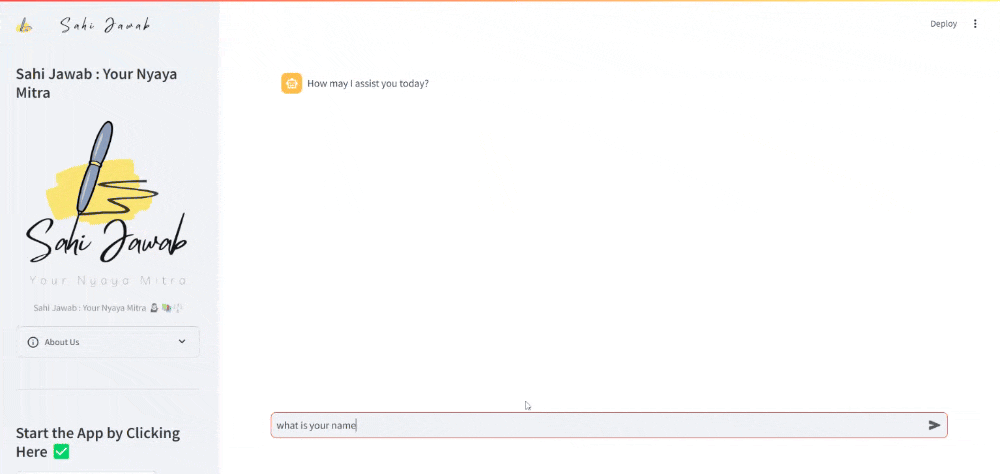
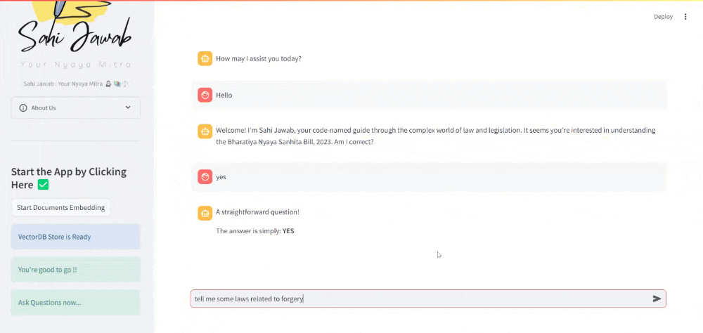

# Sahi Jawab

Hii, I am your go-to platform for all your legal queries. We have embedded the entire Bhartiya Nyaya Sanhita to provide accurate and reliable information on Indian laws. Our aim is to make legal knowledge accessible to everyone. Simply ask your questions, and our intelligent system will guide you with clear and concise answers. Whether you're seeking legal advice or just curious about the law, Sahi Jawab is here to help.

## Technologies Used
1. LLM's
2. Generative AI
3. Ollama (for local embedding)
4. LLama3 Model (Open Source Model)
5. Streamlit (for Web UI Interface)

### Screenshots

